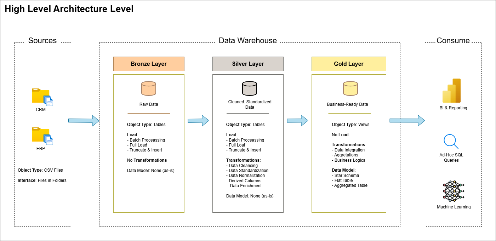

#  End-to-End Sales Data Pipeline & Analytics Dashboard

This project demonstrates the design and implementation of a complete **data engineering and analytics workflow**, from raw data ingestion to business intelligence reporting.

It follows a modern **Medallion Architecture (Bronze → Silver → Gold)** using **SQL Server**, and delivers insights through an interactive **Power BI dashboard**.



---

##  Project Objective

To build a scalable data pipeline that transforms raw operational data into **business-ready insights** for decision-making.

---

##  Architecture Overview

* **Bronze Layer** → Raw ingestion from CRM & ERP sources (CSV)
* **Silver Layer** → Data cleaning, standardization, and transformation
* **Gold Layer** → Star schema modeling (Fact & Dimension tables)

---

##  Data Pipeline Flow

```text
CRM / ERP → Bronze → Silver → Gold → Power BI Dashboard
```

---

##  Dashboard Preview

> Key metrics: Sales, Orders, Customers, Cost, Profit

* Sales trends over time
* Top-performing products
* Customer segmentation
* Country-level sales distribution
* Profitability insights

---

##  Data Modeling

* Fact Table: `gold.fact_sales`
* Dimension Tables:

  * `gold.dim_customers`
  * `gold.dim_products`

Schema follows **star schema design** for analytical performance.

---

##  Technologies Used

* **SQL Server** (Data Warehouse)
* **T-SQL** (ETL & Transformations)
* **Power BI** (Dashboard & Visualization)
* **GitHub** (Version Control)

---

##  Repository Structure

```text
datasets/        Raw source data (CSV)
docs/            Architecture diagrams & models
scripts/         SQL scripts (Bronze / Silver / Gold)
powerbi/         Power BI dashboard (.pbix)
tests/           Data validation scripts
```

---

##  Key Highlights

* Built a full **ETL pipeline using SQL**
* Designed **star schema for analytics**
* Created **business KPIs (Sales, Cost, Profit)**
* Integrated **Power BI dashboard with Gold layer**
* Applied **data modeling best practices**

---

##  Note

This project is inspired by a tutorial, but implemented independently with custom improvements, structure, and enhancements.

---

##  Author

Idham Zuhri
